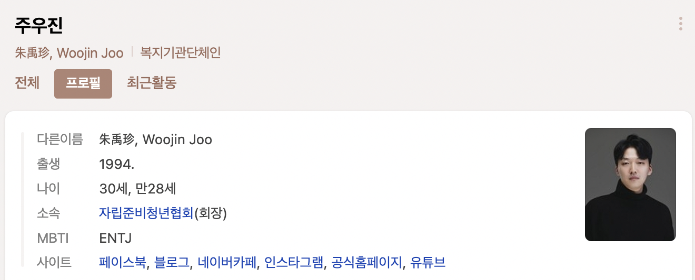
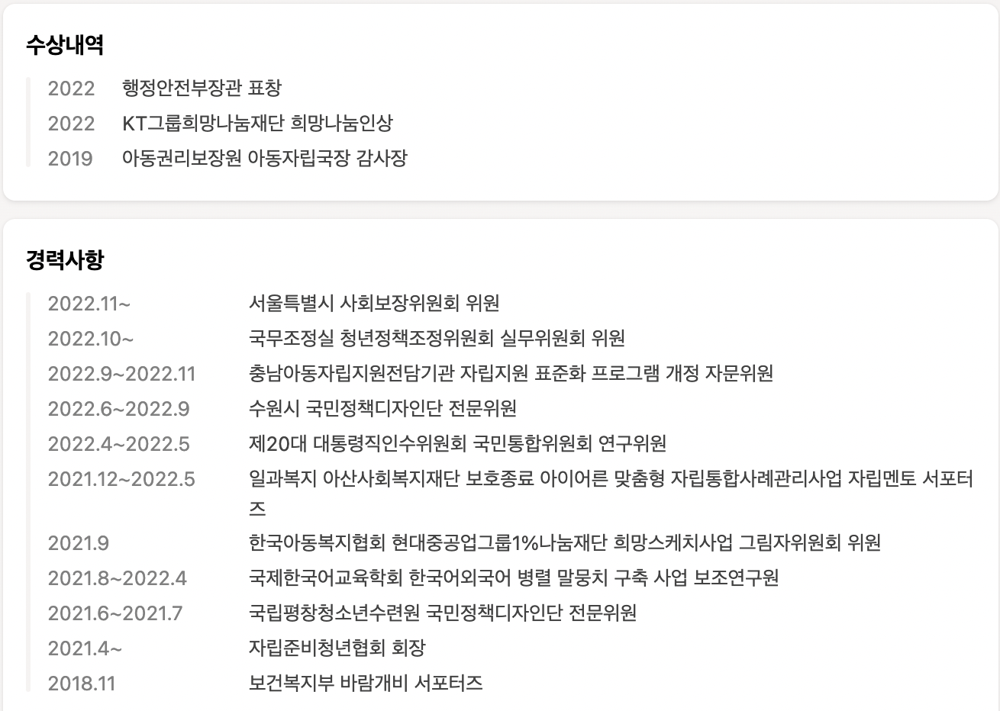
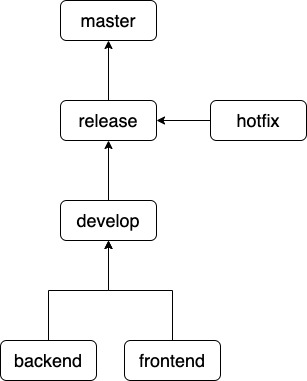
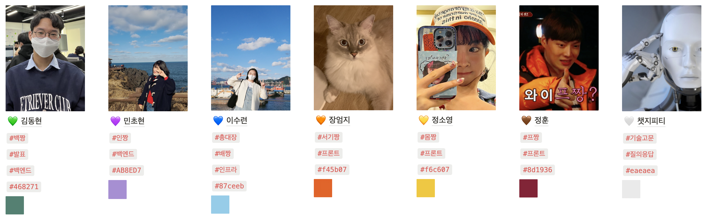

# 서비스 소개

## 1. 서비스 개요
- 한줄소개 : 자립준비청년들의 건강한 자립을 돕기 위한 경제・복지・일자리 정보 제공, 커뮤니티 및 후원 플랫폼
- 서비스명 : **이음**

**타켓**🎯
- 자립을 해나가고 있는 자립준비청년
- 자립준비청년들의 자립을 돕고자하는 사람들

## 2. 서비스 기능
### 해류병 고민 상담
- 고민을 작성하면 `익명의 3명`에게 보내지고, 답장을 받을 수 있음
- 자격 등 검증 거쳐서 `검증된 사람`에게만 발송될 수 있도록
- 멘토로서의 역할을 할 수 있거나 등
- 고민을 보낼 때 누구에게 답변을 받고싶은지 체크(ex. 전문상담가, 같은 자립준비청년 등)

### 물품 펀딩
- 자립준비청년의 `꿈을 이루어가는 데에 필요한 물건`을 펀딩
- 자립준비청년이 자신의 목표, 꿈과 함께 갖고 싶은 물건을 올림
- 물건의 금액이 모두 모이면 펀딩을 종료
- 자립준비 청년은 펀딩된 물건을 받은 후 활용하는 사진이나 글을 작성
- 해당 사진이나 글은 펀딩에 참여한 사람들만 볼 수 있도록 함

### 꿀팁게시판
- 생활하면서 생기는 궁금한 점을 물어보고 답변받을 수 있는 게시판
- 네이버 지식인의 방법을 가져올 예정

### 복지 및 일자리 정보제공
- 자립준비청년들이 제공받을 수 있는 복지 정책을 모아 놓음
- 일자리를 직접 게시하는 것이 아닌, 신뢰할 수 있는 일자리를 제공하는 기관 및 업체로 링크
- 성별, 나이, 지역 등에 따른 `개인에게 맞춤화된 정보` 제공

## 3. 서비스 자문
- 자립준비청년들에게 더욱 실용적이고 신뢰도 높은 서비스를 만들기 위해 해당 분야에서 오랫동안 몸담아온 전문가분들에게 자문 요청

- 컨텍 연락 본문
> 주우진 협회장님 안녕하세요.
저희는 삼성청년SW아카데미(SSAFY) 8기 교육과정을 진행하고 있는 교육생 6인입니다. (이수련, 김동현, 민초현, 장엄지, 정소영, 정훈) 
저희 6인은 자립준비청년을 위한 어플리케이션 개발을 기획하고 있습니다.
현재 자립준비청년에게 현실적으로 유용한 기능을 제공하기 위해 자료조사를 진행하고 있습니다.
신문기사, 통계자료, 정책 보고서 등 여러 자료들을 참고하며 서비스를 기획하고 있지만 어떠한 기능에 집중해야 할지 선뜻 정하기 어려운 상태입니다. 
자립준비청년들을 위한 다양한 활동을 하고 계시는 협회장님께 직접 조언을 구한다면 자립준비청년에게 실제로 유용한 기능들에 집중하여 개발할 수 있을 것 같습니다.
비록 교육과정 특성상 약 7주간 단기적으로 기획 및 개발하여 운영되는 서비스이지만, 진정성 있게 기획하여 자립준비청년의 이야기를 여러 사람들에게 알리고 싶습니다.
가능하시다면 서면으로 몇 가지 질문에 대해 답변을 받고 싶습니다. 소중한 시간을 내어 답변해주시면 저희에게 정말 큰 힘이 될 것 같습니다.
  하단에 연락처 남겨드립니다. 편하신 방법으로 연락주시면 감사하겠습니다.
  이수련
 이메일 : dolpong_@naver.com
 휴대폰 : 010-7614-3400
 인스타그램 : sryeon97

## 4. 서비스 외
### 깃 브런치 컨벤션

### 깃 커밋 메시지 컨벤션
0. BE/FE/DB/DOCS/ETC 지정
- 커밋 파트 작성하기
    - ex) [BE] Feat: 회원가입 API 추가
1. 커밋 유형 지정
- 커밋 유형은 영어 대문자로 작성하기
    | 커밋 유형 | 의미 |
    | --- | --- |
    | Feat | 새로운 기능 추가 |
    | Fix | 버그 수정 |
    | Docs | 문서 수정 |
    | Style | 코드 formatting, 세미콜론 누락, 코드 자체의 변경이 없는 경우 |
    | Refactor | 코드 리팩토링 |
    | Test | 테스트 코드, 리팩토링 테스트 코드 추가 |
    | Chore | 패키지 매니저 수정, 그 외 기타 수정 ex) .gitignore |
    | Design | CSS 등 사용자 UI 디자인 변경 |
    | Comment | 필요한 주석 추가 및 변경 |
    | Rename | 파일 또는 폴더 명을 수정하거나 옮기는 작업만인 경우 |
    | Remove | 파일을 삭제하는 작업만 수행한 경우 |
    | !BREAKING CHANGE | 커다란 API 변경의 경우 |
    | !HOTFIX | 급하게 치명적인 버그를 고쳐야 하는 경우 |
2. 제목과 본문을 빈행으로 분리
- 커밋 유형 이후 제목과 본문은 한글로 작성하여 내용이 잘 전달될 수 있도록 할 것
- 본문에는 변경한 내용과 이유 설명 (어떻게보다는 무엇 & 왜를 설명)
3. 제목 첫 글자는 대문자로, 끝에는 `.` 금지
4. 제목은 영문 기준 50자 이내로 할 것
5. 자신의 코드가 직관적으로 바로 파악할 수 있다고 생각하지 말자
6. 여러가지 항목이 있다면 글머리 기호를 통해 가독성 높이기

### 크레파스 팀원 소개

